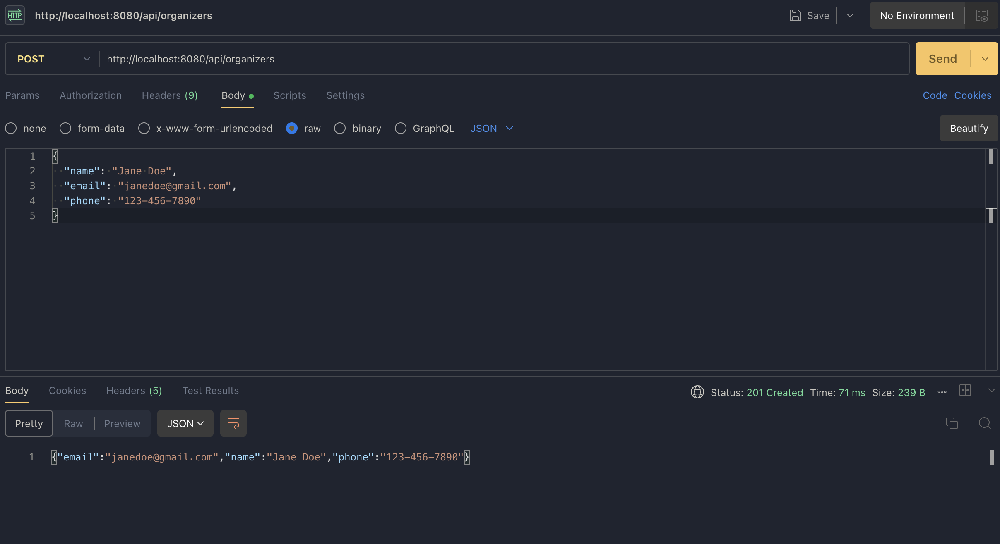
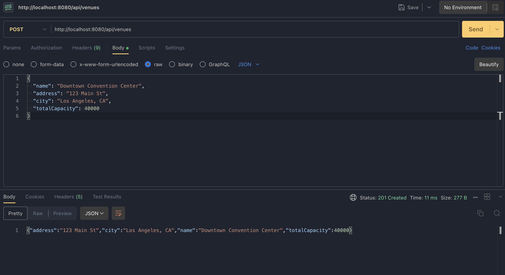
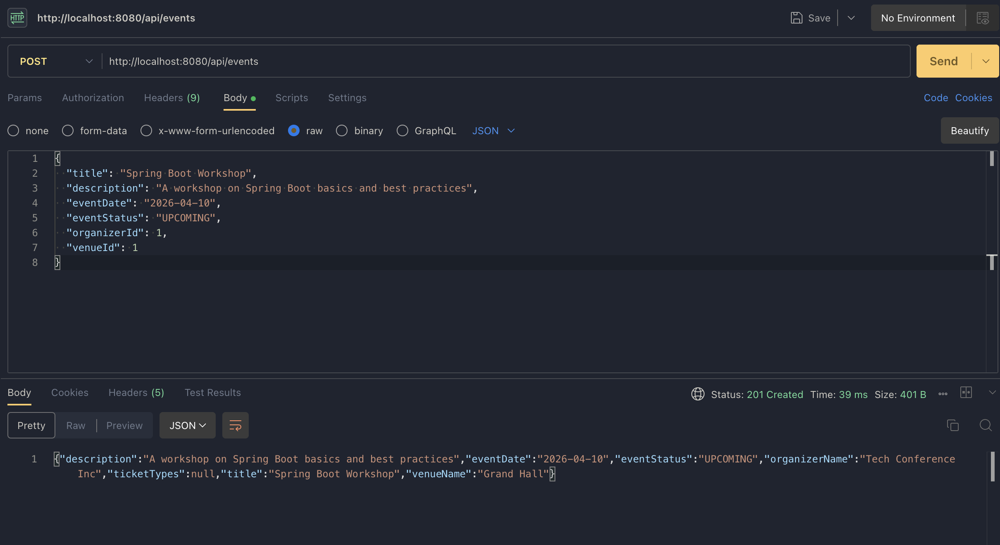
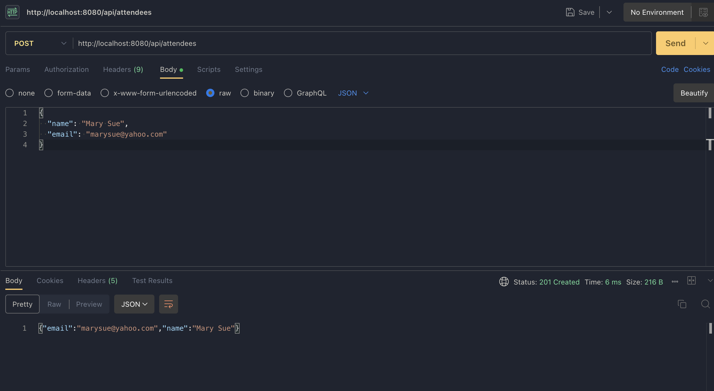
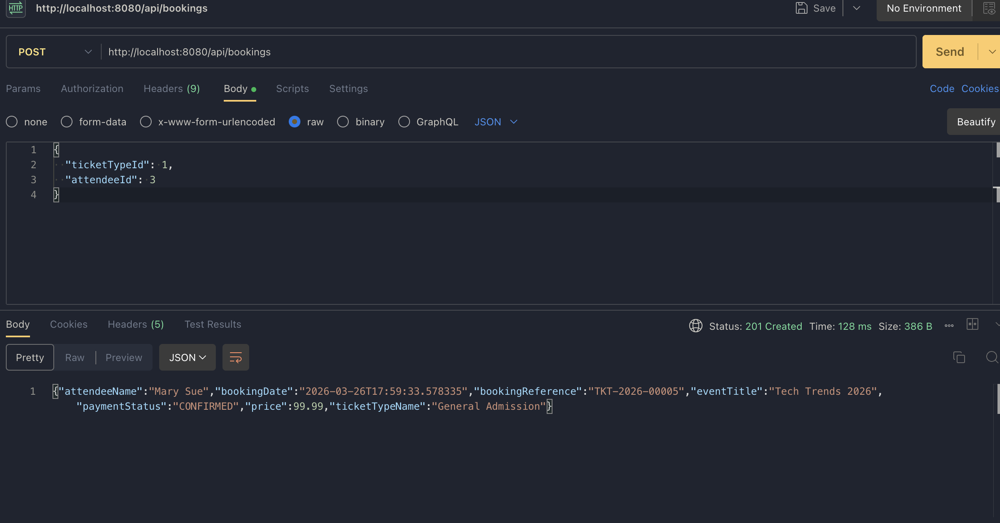
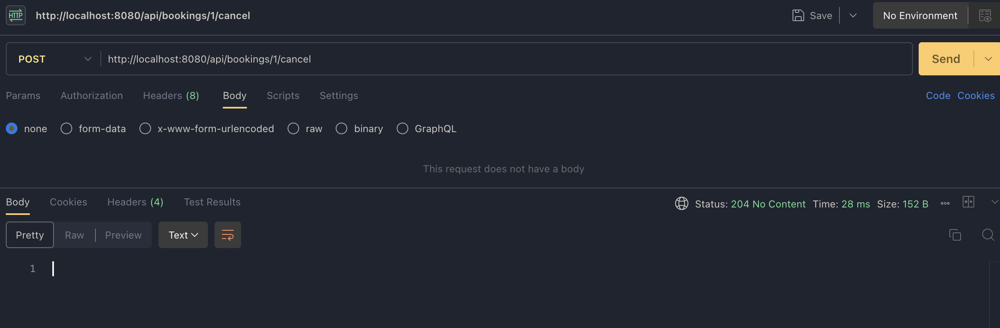
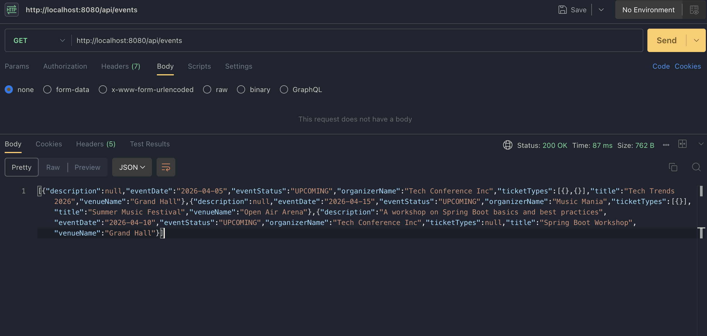
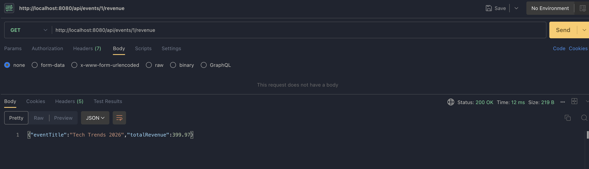
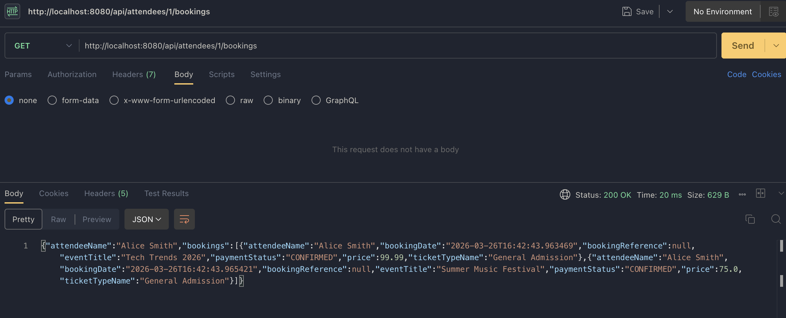

# CPSC449 Midterm Project: Event Ticketing System
*By Madeline Savoiu (884984097)*

## Overview

The backend application is split into three logical tier by folder: the controller, service, and repository layer. The files in the controller layer contain the definitions for required API routes for each entity. The service layer contains calls to the repository layer and functions containing underlying business logic that are called by the controllers.

The application also defines several data transfer objects (DTOs) for passing information between the application's layers. These include the required DTOs outlined in the assignment, as well as other DTOs create to make API route development smoother.

[Demo video](https://youtu.be/25pgGE0kCOc)

## API Testing
### POST /api/organizers

### POST /api/venues

### POST /api/events

### POST /api/attendees

### POST /api/bookings

### POST /api/bookings/{id}/cancel

### GET /api/events

### GET /api/events/{id}

### GET /api/events/{id}/revenue

### GET /api/attendees/{id}/bookings

